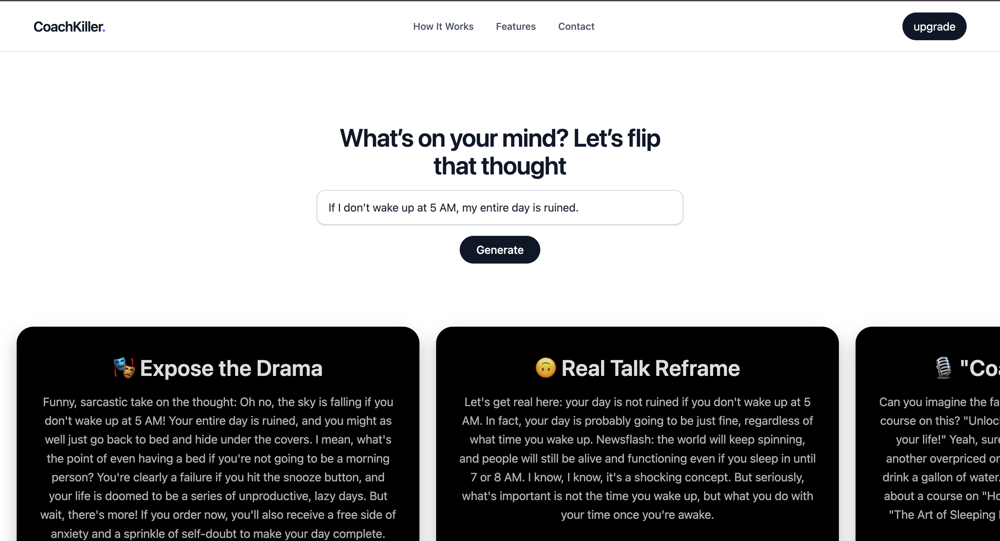

# ✨ CoachKiller — Hilarious AI Thought Reframer (Powered by LLM)

## Project Overview

**CoachKiller** is a no-fluff, anti-toxic positivity AI app that hilariously reframes your most dramatic inner thoughts using LLM-powered coaching sass. Think of it as your brutally honest, slightly sarcastic, and secretly insightful mental coach — without the $997 webinar.

Built with React, Tailwind CSS, and a backend powered by OpenRouter's LLM API, CoachKiller breaks your thought spiral into five fun-sized roast sessions — each with a punchy title, a sharp perspective shift, and a mic-drop ending.

---

## Features
- 💭 Thought Input: Enter dramatic, anxious, or spiraling thoughts in plain language.
-  LLM Breakdown Engine: Powered by IA, the AI breaks each thought into:
-  Expose the Drama
-  Real Talk Reframe
- "Coach" Commentary
-  Do This Instead
-  Reality Check Mic Drop
- Premium UI Experience: Horizontally scrollable, animated card interface built with Tailwind and React.
- Mobile-Responsive: Swipe-friendly layout, works on any device.
-  No BS Coaching: Skips toxic positivity. Offers real advice with a wink of sarcasm.
---

## Technologies Used

- **React:** UI component library
- **Tailwind CSS:** Utility-first CSS framework for styling
- **Vite:** Fast development and build tool
- **Express** Node.js server for API proxying and LLM integration
- **OpenRouter API**: (model: **meta-llama**)LLM service to generate output
---

## Getting Started

### Prerequisites

- Node.js (v20.19.0 or higher recommended)
- npm or yarn package manager
- new api key from OpenRouter 

### Obtaining an API Key
- To use the LLM features, you need an API key from OpenRouter:

- Visit OpenRouter and sign up for a free account.

- Navigate to your dashboard and generate a new API key.

- Copy the key and add it to your .env file as API_KEY.

- Restart your backend server to load the new environment variable.

### Installation

```bash
git clone https://github.com/ziadkaroune/COACHKILLER.git
cd COACHKILLER
```

### Running frontend
```bash
cd frontend
npm install
npm run dev
http://localhost:5173/ (depends your vite port config)
```
### Running backend
```bash
cd backend

create .env file \
API_KEY=your_apikey_here (without a space check .env.example)\
PORT=3000

node server.js
http://localhost:3000 
```

[](https://creativecommons.org/licenses/by-nc/4.0/)
